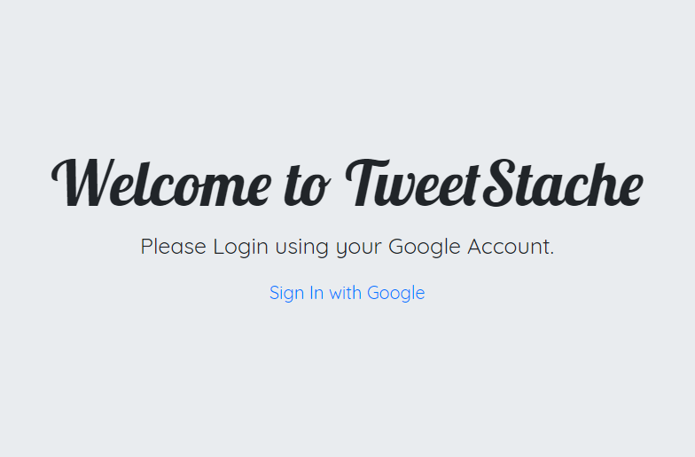
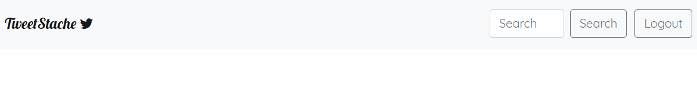
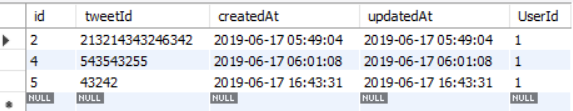

# TweetStache

## Description

  - A stylistic improvement on the way our users absorb media through Twitter.
  - Users will search for topics TweetStache will return tweets matching that tag and display to the browers dynamically creating tweets that scroll into the page
  - Users will be able to save and delete tweets to their profile which is stored on our database
  - Sign in through your google account

## Installation

  - clone/run this repo by copying the clone link: 'https://github.com/RussDERM/Project_2_Group_6'
  - open up gitbash in your cmd line and run git clone url to location of your choice on your local directory.
  - open the files in your code editor and open in browers
  - verify all the node packages have been insstalled correctly with `npm install`

## Technologies Used
  - HTML
  - JavaScript
  - JQuery
  - ajax
  - masonry.js
  - scrollreveal
  - bootstrap
  - Twitter API
  - Twit node package
  - passport.js
  - Google Oauth with `passport-google-oauth`

## Future Updates
  
  - Implement a news feed tab/section to display fact checker tweets in association with the searched news tag
  - Implement additional tables to store more user data across the site
  - Implement a kill switch to remove all users and their data for admin sign in
  - Updating hosting to live stream and store beyond 512MB limit
  - Implement additional widgets for categories

## Contributors
  - [Russ Dermody](https://github.com/RussDERM)
  - [Taylor Bradley](https://github.com/trbradley48)
  - [Cassie Birkbeck](https://github.com/cnbirkbeck)
  - [Julian Piron](https://github.com/Pironj)

## ScreenShot of App
  # TweetStache Login Page

  # Main Page

  # API Call

  # Database
